# 3x3 Time Management App User Guide  

- [3x3 Time Management App User Guide](#3x3-time-management-app-user-guide)
  - [1. Introduction](#1-introduction)
    - [1.1 Purpose](#11-purpose)
    - [1.2 Audience](#12-audience)
    - [1.3 Scope](#13-scope)
  - [2. Product Overview](#2-product-overview)
  - [3. Getting Started](#3-getting-started)
    - [3.1 Install the App](#31-install-the-app)
      - [Install from the Official Website](#install-from-the-official-website)
      - [Install on iOS](#install-on-ios)
      - [Install on Android](#install-on-android)
    - [3.2 Main Interface Overview](#32-main-interface-overview)
  - [4. Using the App](#4-using-the-app)
    - [4.1 Customize the Main Page](#41-customize-the-main-page)
    - [4.2 Create Tags](#42-create-tags)
    - [4.3 Formulate and Link Plans](#43-formulate-and-link-plans)
    - [4.4 Record Time](#44-record-time)
    - [4.5 Scene Setup](#45-scene-setup)
    - [4.6 Store Pending Items](#46-store-pending-items)
    - [4.7 Other Pages](#47-other-pages)
  - [5. Pro Features](#5-pro-features)
    - [Log Feature (Pro Exclusive):](#log-feature-pro-exclusive)
    - [Progress Bar Feature (Pro Exclusive):](#progress-bar-feature-pro-exclusive)
    - [Custom Tabs (Pro Exclusive):](#custom-tabs-pro-exclusive)
    - [Sub-tags (Pro Exclusive):](#sub-tags-pro-exclusive)
  - [6. Tips](#6-tips)

## 1. Introduction

### 1.1 Purpose

This document provides instructions for using the 3x3 Time Management App, and describes the core functions and basic workflows for managing tasks and tracking time in the app.

### 1.2 Audience

This document is intended for users who want to manage their plans and life using the 3×3 time management method. No prior experience with the app is required.

### 1.3 Scope

This guide covers the core functions available on both Android and iOS. Features that are currently implemented only on Android are not included.  

It also introduces several Pro features. This guide does not provide a complete reference for all Pro functions.

## 2. Product Overview

The 3x3 Time Management App helps users organize tasks, track time, and connect long-term goals with daily activities.

The app provides the following core functions:

- Record daily activities using a timeline.

- Link tasks to daily, weekly, monthly, and yearly plans.

- Organize tasks with tags.

These features allow users to track how they spend time and maintain a structured task system.

## 3. Getting Started

### 3.1 Install the App

Take the following steps to install the 3x3 app on your mobile device:

#### Install from the Official Website

1. Open a web browser.

2. Go to the following website: **<https://today3x3.com/>**.

3. Select the download option for your mobile platform.

#### Install on iOS

1. Open the App Store.

2. Search for 3x3.

3. Tap Install.

4. Open the app after installation.

#### Install on Android

1. Open the App Market on your device.

2. Search for 3x3.

3. Tap Install.

4. Open the app after installation.  

### 3.2 Main Interface Overview  

When you first open the app, all tab pages appear at the top of the main screen.  
 

  
Each tab page displays related content and usage hints.

## 4. Using the App

This section explains main tasks users can perform in the app.  

### 4.1 Customize Tab Pages

When you open the app for the first time, all tab pages appear at the top of the interface by default. You can customize these tab pages to better match your workflow.  

You can:

- Hide unused tab pages

- Rename tab pages

- Change the order

Take the following steps to customize tab pages:  

1. Tap the blank area near the green text on the bottom of the page.

2. Tap the 设置 icon to open the setting page.

   **Figure 1. the green text on the bottom**  

      

3. Tap **标签页** on the setting page.

   **Figure 2. the setting page**  

   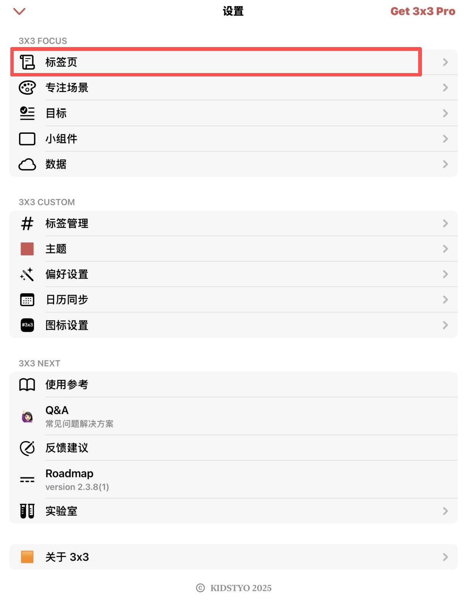
   
4. Tap the **eye icon** next to a tab page to hide it.  

   **Figure 3. Hidden tabs are folded** 

   

5. Long-press the tab page row to change the order.

6. Tap a tab page to rename it.

### 4.2 Create Tags

Tags categorize tasks and organize schedules more effectively.

For example, you can create tags such as:

- Work

- Study

- Personal

- Exercise

Take the following steps to create a tag:

1. Open the Settings page.

2. Tap **标签管理**.

3. Tap **新增** in the top-right corner.   

4. Enter the tag name and save it.

### 4.3 Formulate and Link Plans

The app allows you to create plans at multiple levels, including:

- Life goals

- Annual plans

- Monthly plans

- Weekly plans

- Daily to-do lists

You can also link tasks across these plans, and it helps you track progress over time.

Take the following steps to create and link plans:

1. Choose the corresponding tab page:

    - "今天" page: today to-do list
    - "我的一周" page: a weekly plan
    - "2026" page: a yearly plan
    - "Life" page: life plans

2. Tap the **"+"** button to create.

3. Use the **"@"** symbol to link tasks to plans.

    - Tap the **"@"** symbol below the 待办创建 page.
    - Tap the title of the related plan.
    - After selection, the linked plan appears in the lower-left corner of the page.  

    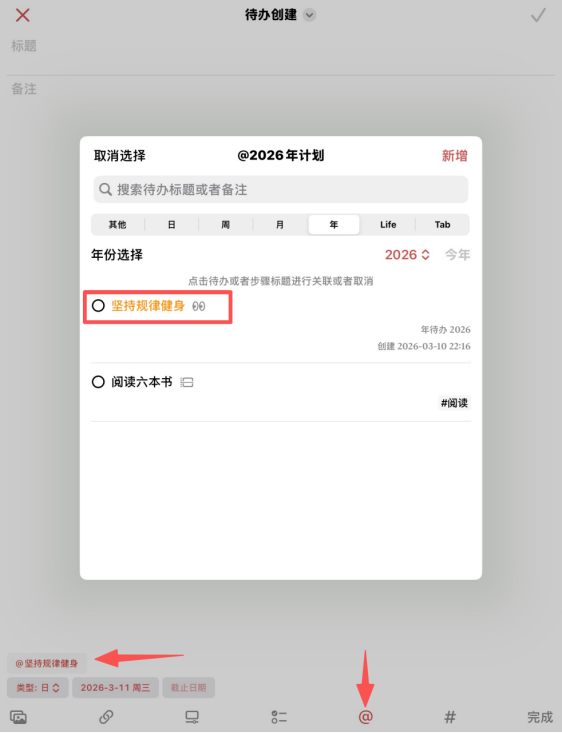  
  
4. Tap the **"#"** symbol to assign tags to the task.  

  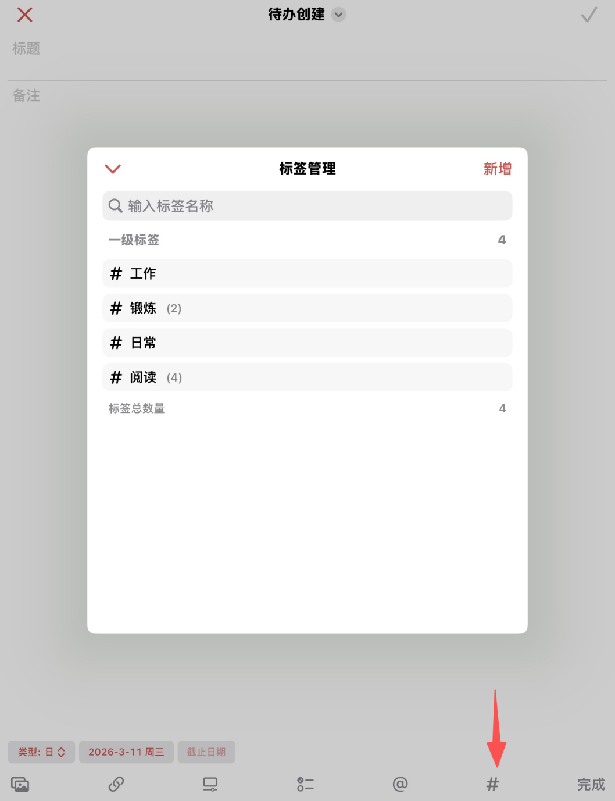

### 4.4 Record Time

The Timeline feature records how you spend your time during the day. You can track activities in real time or record them after completion.

Take the following steps to record time:

1. Start Recording Time:  

    Tap 时间线 tab page. You can record activities in two ways:

    - **Record in real time**: Tap **专注** on the timeline page to start the timer.

    - **Record after completion**: Long-press **专注** to add a completed activity.

2. Link Tags and Plans

    Both two recording ways can link the timeline to tags and plans on the record page.

   - Tap the **"#"** symbol to select a tag.

   - Tap the **"@"** symbol to associate a plan.
   
3. View Time Spent on a Plan

   If you link a timeline to a monthly or yearly plan, you can view total time spent on that plan:

   - Tap the **2026** tab page

   - Tap the timeline icon next to the plan  

   **Figure 4. The timeline icon** 
  
   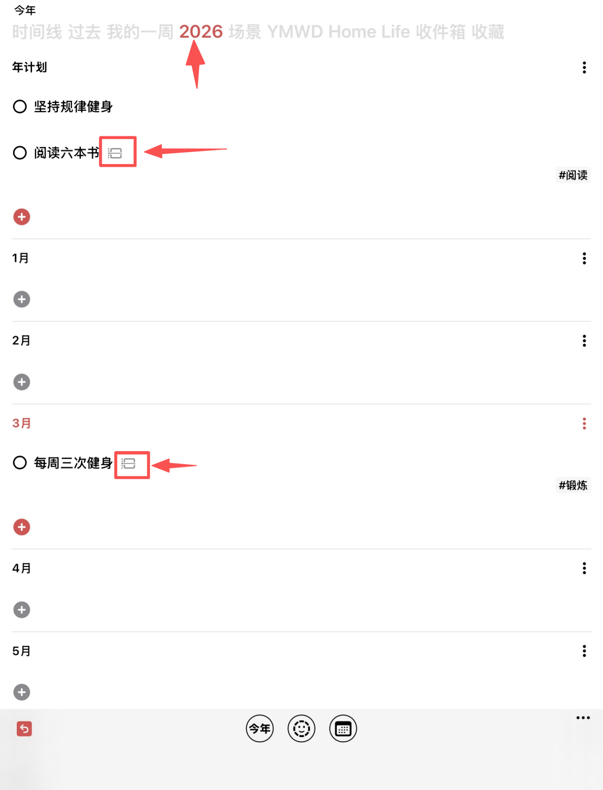  

   This page displays the total time spent on the plan and the timeline of the recorded activities.

   **Figure 5. Time recorded for a plan** 

   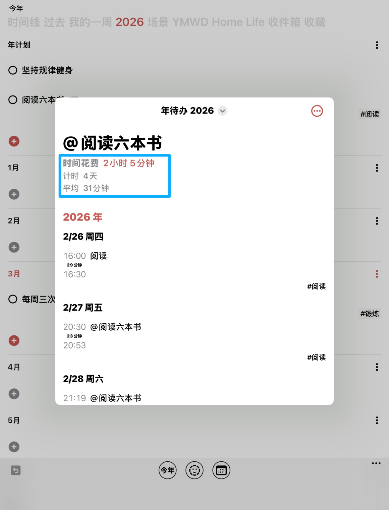
   
5. View Time Analysis

   The app automatically generates a **time analysis pie chart** on 今天 page. The chart summarizes recorded timeline entries by tags.

     

### 4.5 Scene Setup

The Scene Setup feature simplifies time tracking for repeated activities.

For example, you can create scenes such as:

  - Reading

  - Exercise

  - Studying

  - Meetings

Each scene includes predefined tags and linked plans.

Take the following steps to create a scene:

1. Open the 场景 page.

2. Tap the **+** icon.

3. Enter a scene description.

4. Select the related tags and plans.

5. Tap the scene icon to start timing.

6. Tap the icon again to stop recording.

The activity will appear on the timeline page.

### 4.6 Store Pending Items

The 收件箱 tab page stores some undetermined or pending matters.  

1. Tap 收件箱 tab page.  

2. Tap the **+** icon.  

3. Enter the name and description of the item.  

4. If you need to delete an item, tap the gesture icon to the left of the item title.

   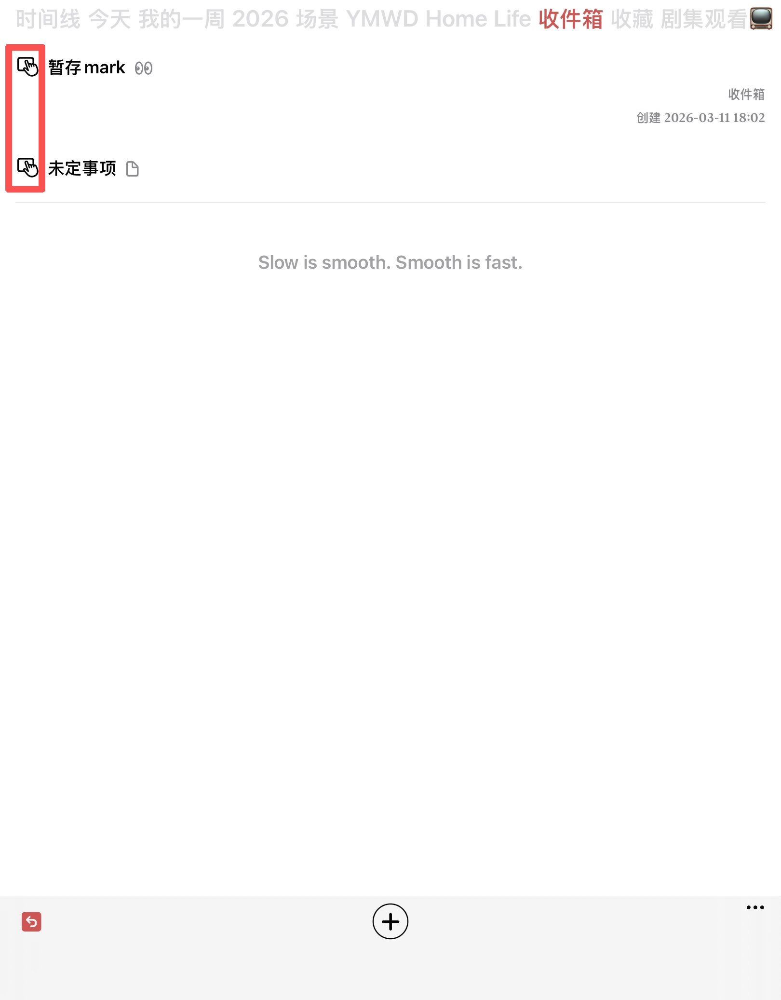

5. Tap 取出 to delete it.

### 4.7 Other Pages  

The other three default tabs display tasks and plans generated in other tabs. Users do not edit content directly on these pages.  

1. **YMWD page**

    The YMWD page displays plans at multiple time levels, including:

   - Today
   - This week
   - This month
   - This year

2. **Home page**

    The Home page presents an overview of all plans and to-do items concisely.  

   **Figure 6. Home page overview**  

   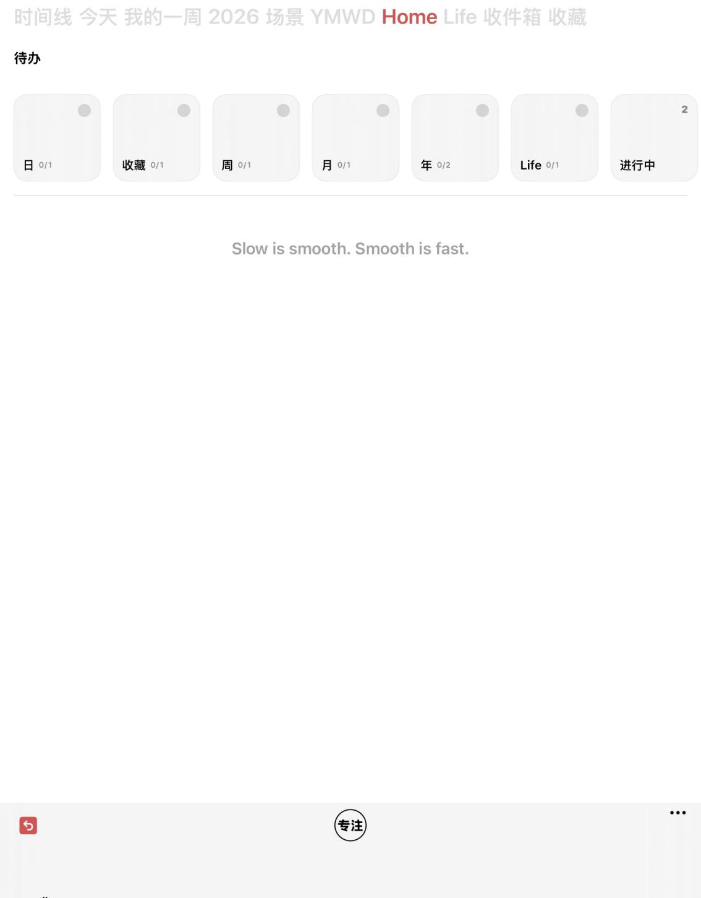
   
3. **收藏 Page**

   The 收藏 page stores important or priority tasks for quick access.

## 5. Pro Features

In addition to the core functions, the app offers Pro services. The Pro service provides additional personalized features:  

- More tab pages
- More tags  
- Pro Template  
- Pro Task  

More pro features are currently under development.

The following sections introduce some Pro features.

### Log Feature (Pro Exclusive):  

The Log feature allows users to record daily reflections and notes, and attach images.

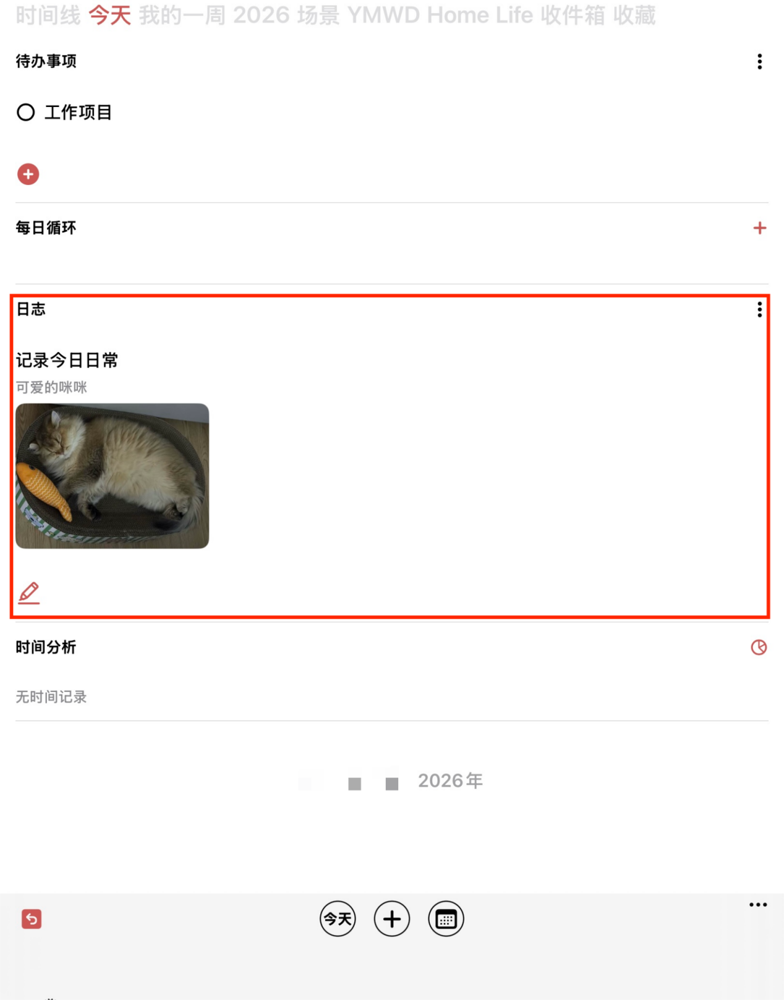

### Progress Bar Feature (Pro Exclusive): 

The Progress Bar feature helps track task completion and update the completion percentage.

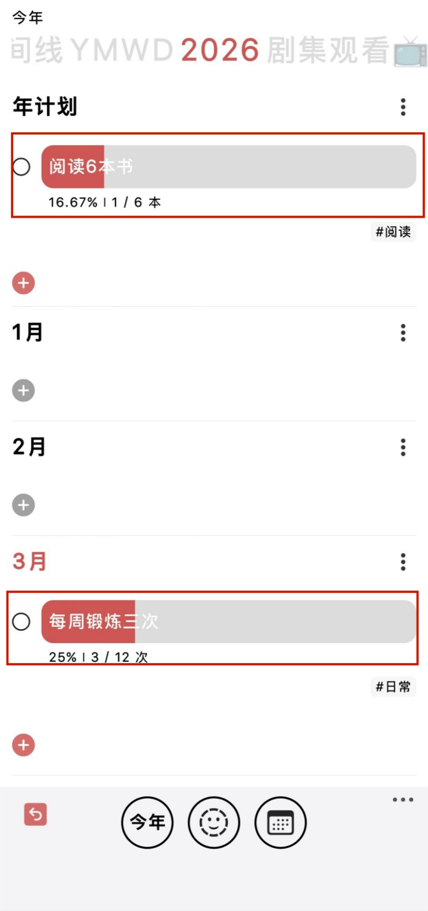  

### Custom Tabs (Pro Exclusive):   

Pro users can create additional tabs for personalized organization.

Examples include:

- Personal library

- Movie list

- Project tracking 

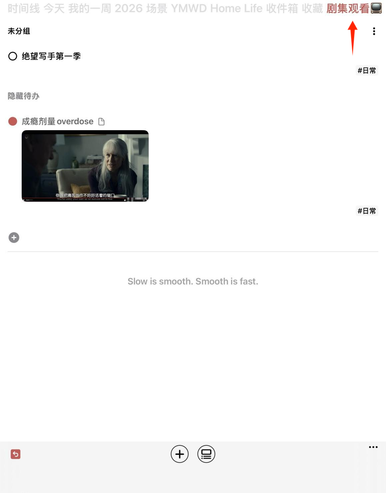   

### Sub-tags (Pro Exclusive):   

The Sub-tag feature allows users to create nested tags under primary tags. This structure helps refine task classification.  

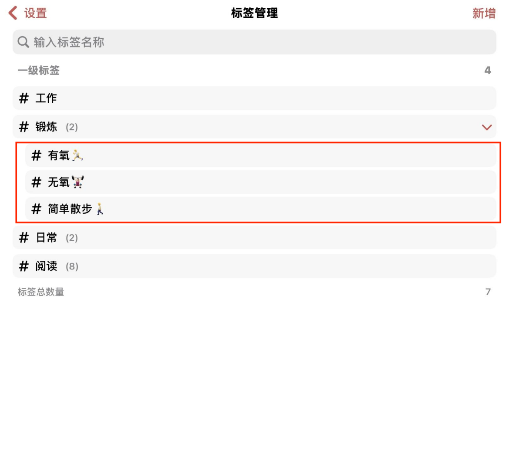 

## 6. Tips

The following tips can help you use the app more effectively:

- Use tags to categorize tasks such as work, study, and personal activities.

- Record time for important tasks regularly to understand how you spend your day.

- Break large goals into smaller plans, such as monthly or daily tasks.

- Review your schedule at the beginning or end of the day to stay organized.
